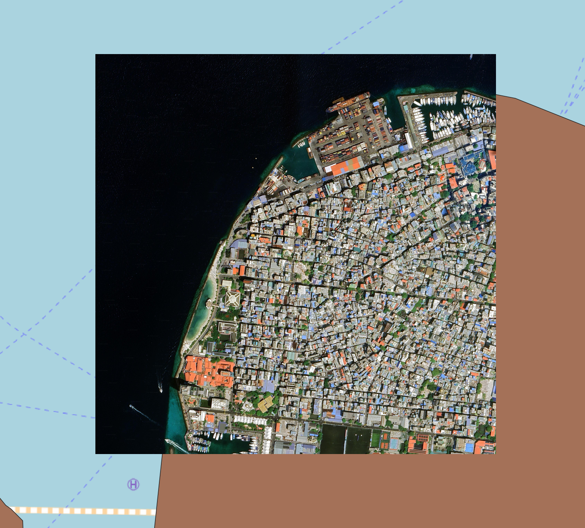
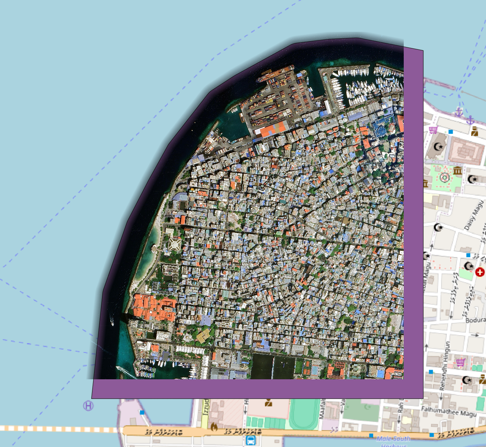

# geotiff-clip-geojson

## ***cliptiff*** - bun cliptiff.ts [options]
**`cliptiff.ts`** is a tiny script for bulk clipping GeoTIFF raster files using a GeoJSON file as a mask.

It uses the `GDAL/OGR` toolset, and works by cropping the provided mask to the extent of each raster file (for optimizing the clipping process) and then using `gdalwarp` to clip the raster file.

Install [GDAL](https://gdal.org/en/stable/) on your Linux/Mac/*nix . The script calls the following binaries: `ogr2ogr`, `gdalwarp`, `gdal_create`

### - `bun install`

### - Place all GeoTIFFs in `UNCLIPPED-GEOTIFFS/`

### - Place the GeoJSON mask in `MASK-GEOJSON/`

## `bun cliptiff.ts --help`
```
Usage: cliptiff.ts [options]
Options:
  -o, --offset <number>   Mask expand offset in meters (default: 0)
  -b, --blend <number>    Blend clipping pixels in px (default: 0)
  -s, --skip              Skip clipping if no intersection (default: false)
  -p, --prefix <string>   Prefix to distinguish blank output files (default: none)
  -l, --loglevel <number> Set log verbosity level (default: 0)
  -h, --help              Show this help message
```

If your mask needs to be expanded by some meters, you can use `-o <number>` or `--offset <number>`. This is useful for adding some buffer to your clipping start.

If you want some smoothing/gradient on the clipped edges, you can use `-b <number>` or `--blend <number>`.

Experiment with `offset` and `blend` values to get the best results for your data. Defaults are if you expect to have a clean mask and no blending.

If you dont want to create blank rasters for GeoTIFFs that do not intersect with the mask, you can use `-s` or `--skip`. The default is `false`, which means you will get a `clipped` raster for every raster in `UNCLIPPED-GEOTIFFS/`.

## Images

### Unclipped GeoTIFF on top of the mask


### Clipped GeoTIFF on top of its temp mask
The mask is extended by `offset` 70 (metres) and the raster is clipped with `blend` of 90 (px)

`bun cliptiff.ts --offset 70 --blend 90`
